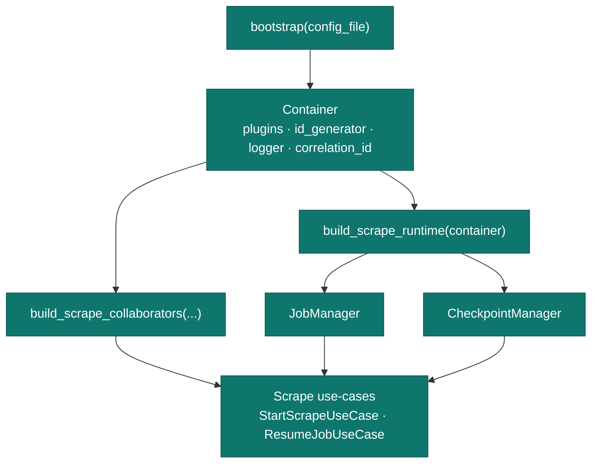
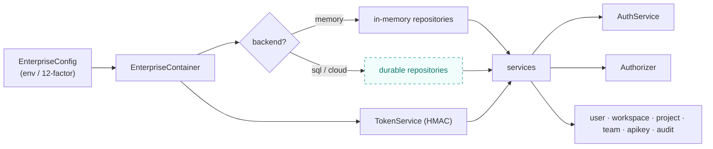

# Dependency Injection

Nexus AI wires collaborators through composition roots rather than global state. This
makes every component testable with fakes and makes persistence swappable.

## Engine composition root

`bootstrap()` returns a fully wired container; applications build their collaborators from
it.

`bootstrap` lives in `nexusai.composition.container`; `build_scrape_runtime` and
`build_scrape_collaborators` live in `nexusai.composition.application`. Use-cases take
keyword-only collaborators and expose an `execute(...)` method.

## Enterprise container

The enterprise layer selects repository adapters from configuration and injects them into
services.

The dashed adapter is the cloud swap-in point — services depend on repository **ports**,
so switching persistence is a wiring change, not a code change.

## Why it matters

-   :material-test-tube:{ .lg .middle } **Testability**

    ---

    Services accept protocol-typed collaborators, so tests inject fakes — no network, no
    database.

-   :material-swap-horizontal:{ .lg .middle } **Swappable persistence**

    ---

    Repositories are ports; the in-memory adapters ship by default and a durable adapter is
    a one-line wiring change.

-   :material-lock:{ .lg .middle } **One place for secrets**

    ---

    The signing secret and backend selection live in the container, never scattered through
    the code.

