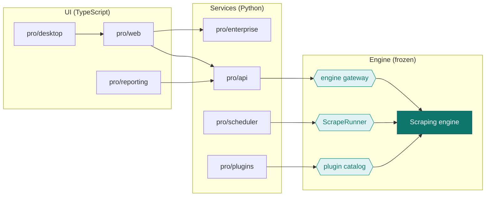
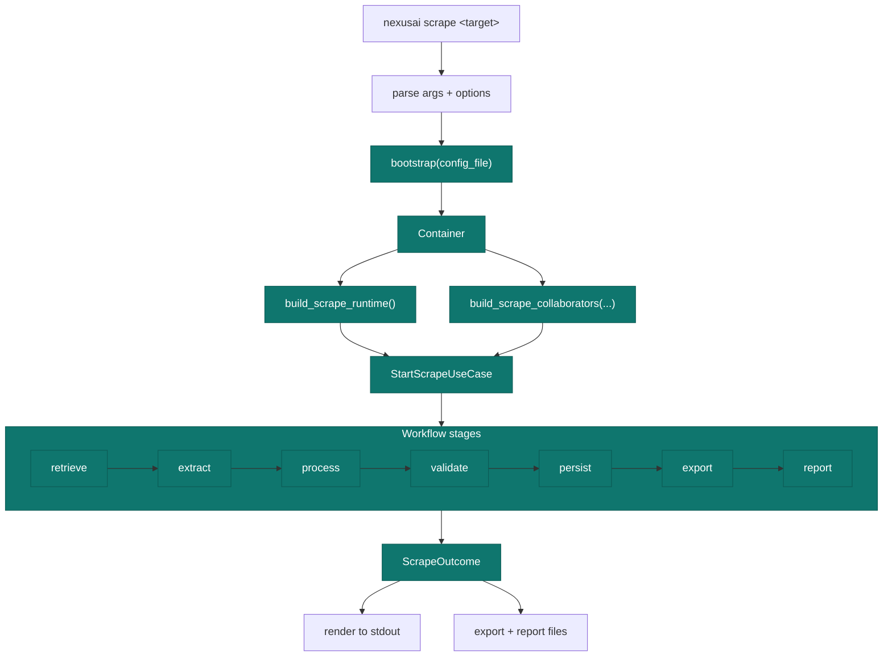

# Diagram Reference

A single place for the platform's cross-cutting diagrams. Diagrams specific to a subsystem
live with their prose:

- [System architecture](overview.md#system-architecture)
- [Dependency injection](dependency-injection.md#engine-composition-root)
- [Request lifecycle (sequence)](request-lifecycle.md#submitting-a-scrape)
- [Scheduler pipeline & state machine](scheduler.md#pipeline)
- [Plugin lifecycle](plugin-system.md#lifecycle)
- [Reporting data flow](reporting.md#data-flow)

## Component & dependency map

The teal nodes are the only seams that touch the engine.

## CLI execution flow

The API's gateway and the scheduler's runner invoke the **same** use-cases the CLI uses;
only the front-end differs.
