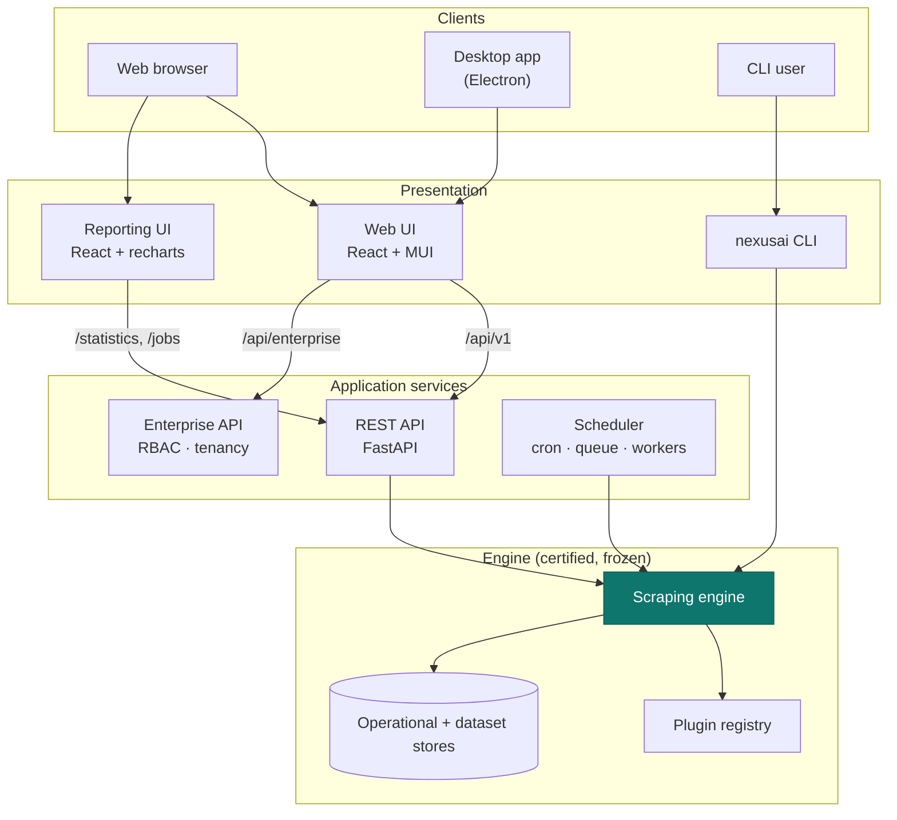

# Architecture Overview

Nexus AI is a certified scraping **engine** reused by a set of **applications**. The
engine follows clean architecture — domain, application and infrastructure layers behind
ports, wired by a composition root — and every application depends on it as a library.

!!! abstract "Principles"
    - **Frozen core.** The engine is reused unchanged across the whole platform.
    - **Isolated coupling.** Applications touch the engine only through a few seams.
    - **Ports & adapters.** Persistence and integration points are protocols with
      swappable adapters, which keeps the system testable and cloud-ready.

## System architecture



## Layers

The engine is organised as concentric layers; dependencies point inward.

| Layer | Responsibility |
|---|---|
| **Domain** | Entities, value objects and policies (jobs, datasets, plugins, versions). Pure, no I/O. |
| **Application** | Use-cases that orchestrate the domain (scrape, resume, queries, doctor). |
| **Infrastructure** | Adapters for I/O — storage, exporters, plugin discovery, browser driver. |
| **Presentation** | The CLI and the surfaces the applications expose. |

## Component responsibilities

| Component | Path | Responsibility |
|---|---|---|
| Engine | `src/nexusai` | Scraping core, CLI, plugin registry |
| REST API | `pro/api` | Expose the engine over HTTP; run scrapes off the event loop |
| Web app | `pro/web` | Operator UI |
| Desktop app | `pro/desktop` | Secure Electron shell with native integration and auto-update |
| Scheduler | `pro/scheduler` | Recurring scrapes, queue, retries, notifications |
| Plugin manager | `pro/plugins` | Install/enable/disable/remove plugins |
| Reporting | `pro/reporting` | Analytics UI |
| Enterprise | `pro/enterprise` | Multi-tenant auth, RBAC, projects, teams, keys, audit |

## The engine seam

Applications reuse the engine through its composition root and a small number of
use-cases, never by reaching into internals.

```python
from nexusai.composition.container import bootstrap
from nexusai.composition.application import build_scrape_runtime, build_scrape_collaborators

container = bootstrap(config_file=None)
jobs, checkpoints = build_scrape_runtime(container)
```

Continue with [Dependency Injection](dependency-injection.md), the
[Request Lifecycle](request-lifecycle.md), or the [full diagram set](diagrams.md).
