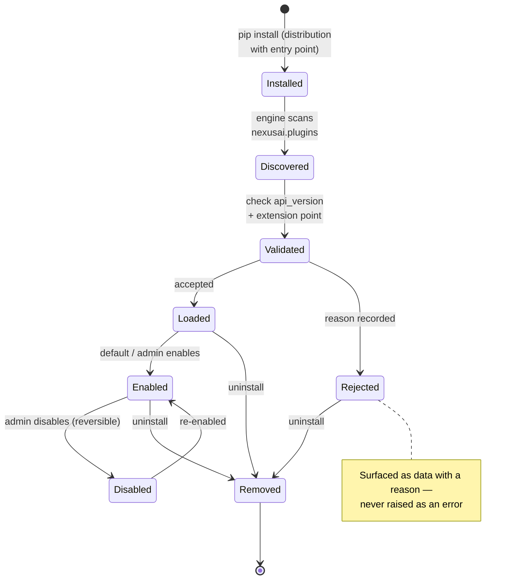
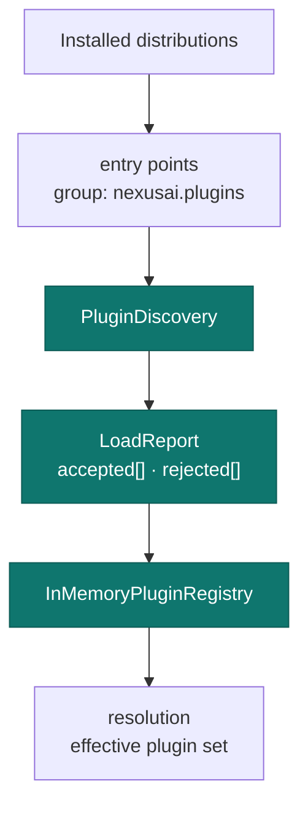

# Plugin System

Plugins are Python distributions that implement one or more extension points and are
discovered from their `nexusai.plugins` entry points. The engine validates and loads
them; the plugin manager adds install/enable/disable/remove on top.

## Lifecycle

## Discovery & correlation

## Compatibility

Each extension point carries its own **API version** (`major.minor`), independent of the
framework release. A plugin is compatible when it targets the same major version and a
minor version no greater than the framework's — additive changes never break existing
plugins.

For the contracts, see the [Plugin API](../plugins/plugin-api.md); to write one, see
[Plugin Development](../plugins/plugin-development.md).
