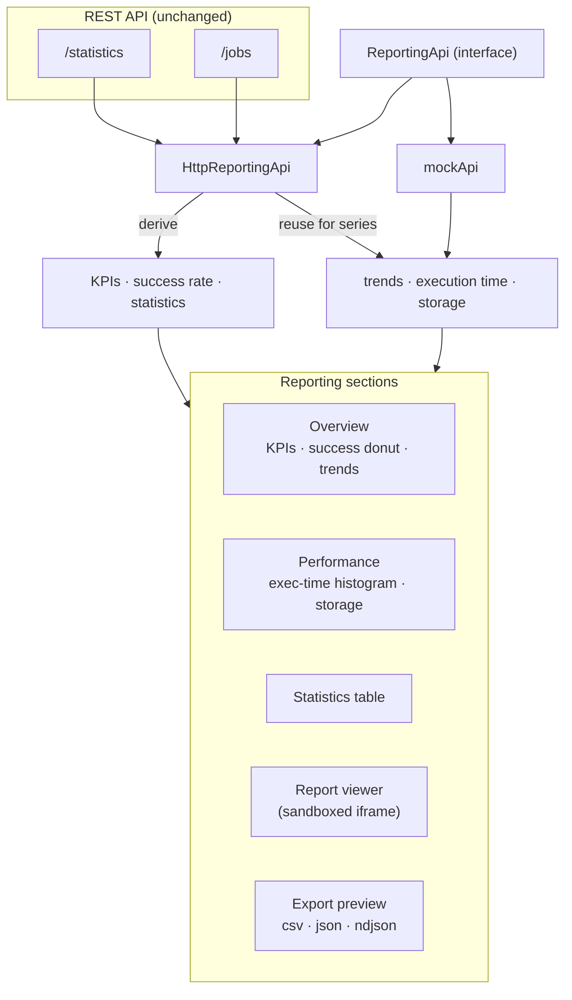
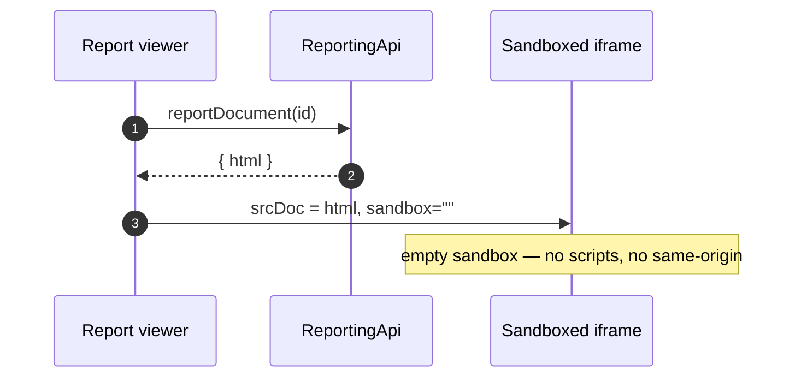

# Reporting Architecture

The reporting app is a read-only analytics surface. It derives what it can from the
existing API and fills the rest from a mock provider — no new backend endpoints are added.

## Data flow

!!! note "Live vs illustrative"
    KPIs, success rate and the statistics table are **live** against a connected backend.
    Trends, execution time and storage series are **illustrative** unless a metrics source
    is wired — adding one would change the backend, which reporting deliberately avoids.

## Safe report rendering

The report viewer renders report HTML inside an iframe with an **empty sandbox**, so
engine-produced artefacts display without running code or reaching the parent page.
