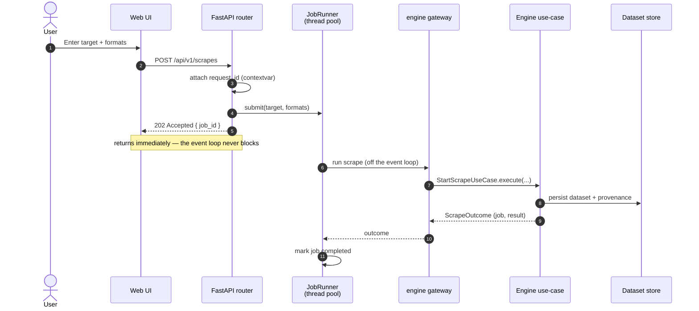
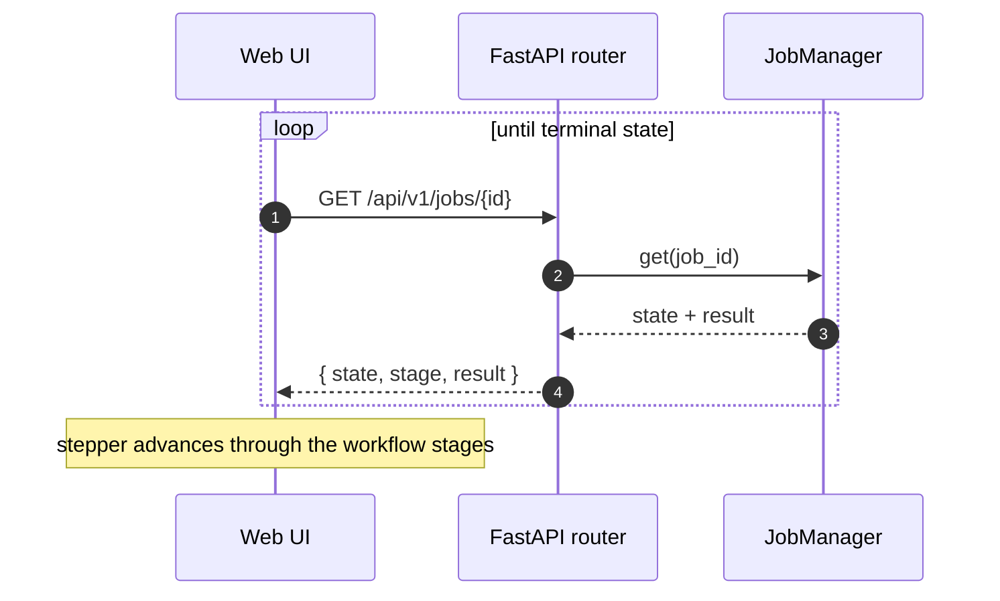
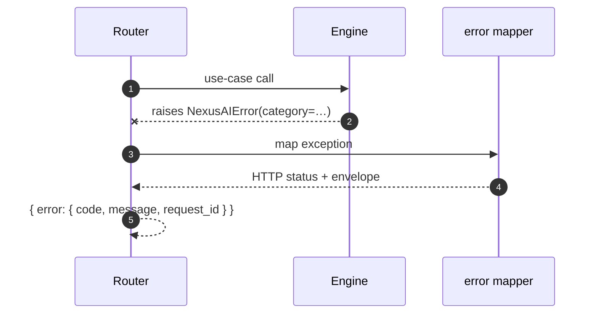

# Request Lifecycle

How a scrape flows through the REST API — from submission to a background run to progress
polling.

## Submitting a scrape

!!! tip "Non-blocking by construction"
    The synchronous engine runs inside a **bounded** thread pool
    (`NEXUSAI_PRO_MAX_CONCURRENT_SCRAPES`, 1–64). The HTTP response returns as soon as
    the job is accepted, so throughput is bounded by the pool, not by request handlers.

## Polling progress

## Error handling

Every failure becomes a stable, correlated envelope — no tracebacks leak, and the
`request_id` ties the response to the structured logs.
