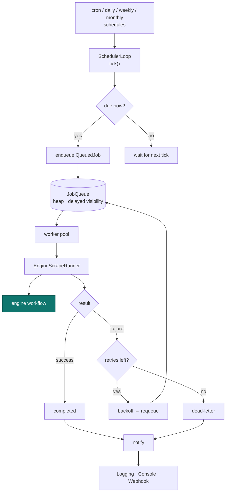
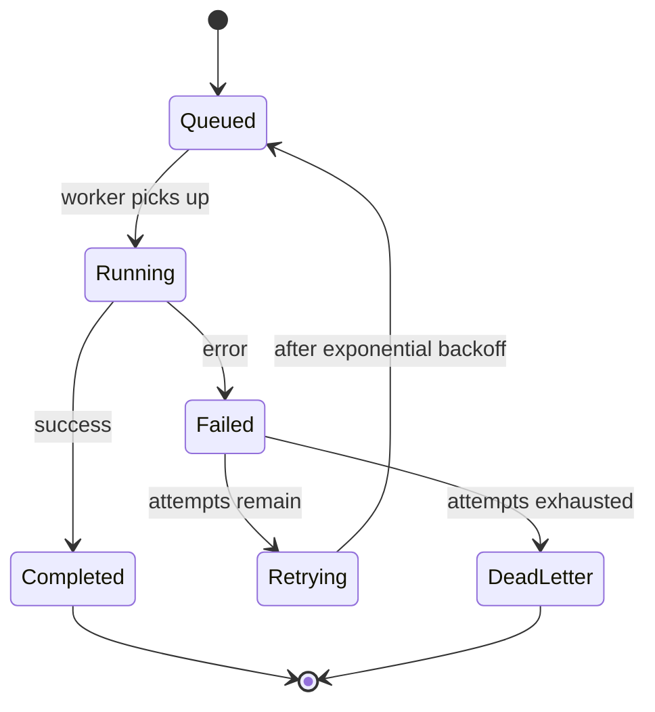

# Scheduler Architecture

The scheduler turns schedules into background scrapes: it computes due times, enqueues
jobs, runs them through a worker pool, and retries with backoff — notifying at each
transition.

## Pipeline

## Run state machine

!!! info "Backoff never busy-loops"
    Retries use the queue's **delayed visibility**: a retried job is invisible to workers
    until its backoff elapses, so waiting costs nothing.

Operating the scheduler is covered in [Administration → Scheduler](../administration/scheduler.md).
