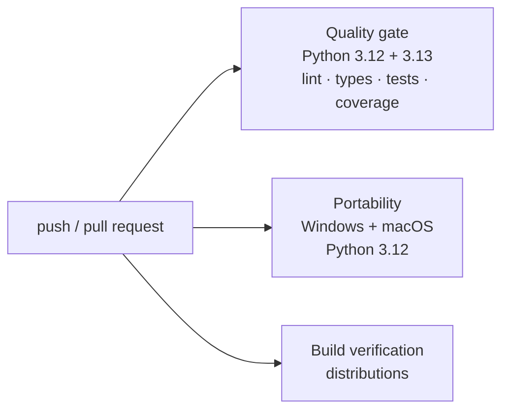
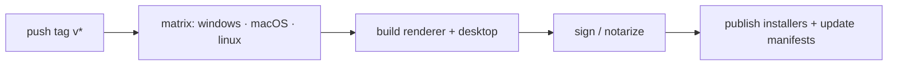

# CI/CD

Two pipelines run in GitHub Actions: continuous integration for the engine and a
tag-triggered release pipeline for the desktop app.

## Continuous integration

The engine workflow (`.github/workflows/ci.yml`) runs on every push and pull request with
three jobs:

| Job | Runs on | Purpose |
|---|---|---|
| **Quality gate** | Ubuntu, Python 3.12 and 3.13 | lint, type-check, tests, coverage |
| **Portability** | Windows and macOS, Python 3.12 | verify cross-platform behaviour |
| **Build verification** | Ubuntu, Python 3.12 | build the distributions |

All three must be green.

## Release pipeline

A tag-triggered pipeline builds, signs and publishes the desktop app for all platforms:

Signing and notarization credentials are provided as CI secrets (see
[Deployment → Release](../deployment/release.md)); nothing secret lives in the repository.

## What CI enforces

- The engine passes lint, types and tests on supported Python versions and operating
  systems.
- Distributions build cleanly.
- Releases are reproducible and signed.

These pipelines back the [certification](certification.md) results.
